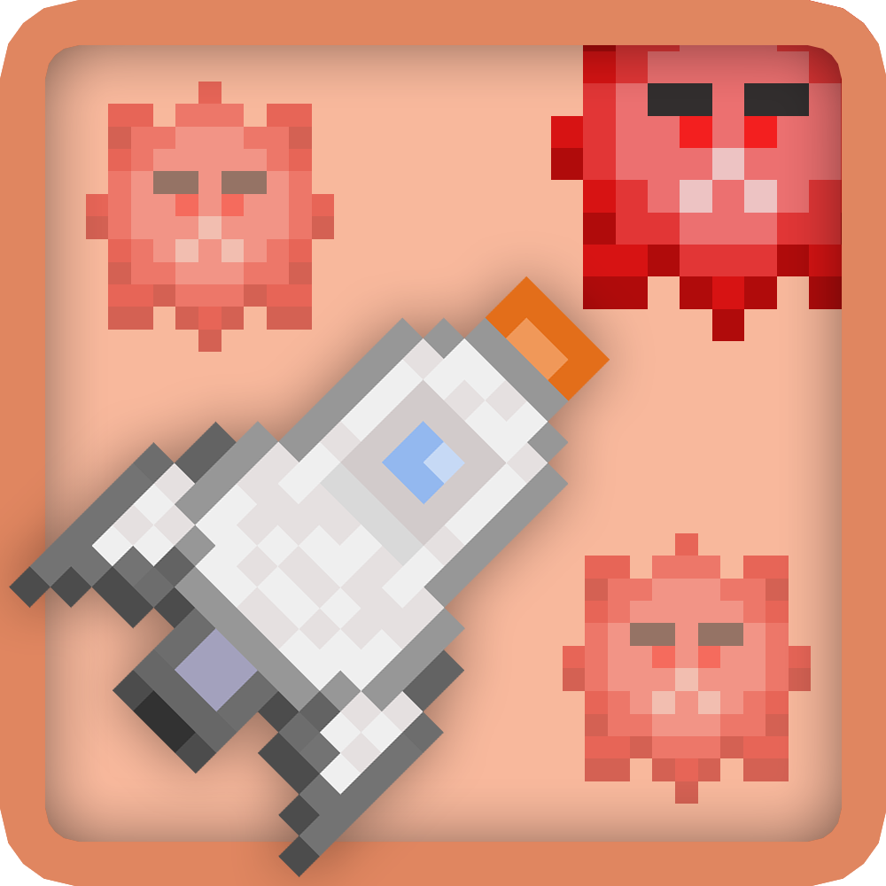

  

  <h1 align="center">UAP : Unité Anti-Parasite</h1>

  

    <a href="https://github.com/Jyel/UniteAntiParasite/releases/download/v0.3.0-alpha/UAP.v0.3.0-alpha.RELEASE.zip"><strong>Download v0.3.0-alpha Release &raquo;</strong></a>
  

This is a **super** simplistic retro in development game. It is a school project.
There is a chance I don't end it when my year has ended.

Ceci est un jeu rétro en développement **très** simpliste. C'est un projet pour mon Bac.
Il y a de fortes chances que je ne le continue pas après que mon année s'est terminée.

## Table Content
- [Change Log](#change-log)
  + [[Unreleased]](#unreleased)
  + [v0.3.0](#v030---2017-05-22)
  + [v0.2.0](#v020---2017-03-17)
- [Controls](#controls)

***
# Change Log
## [[Unreleased]](#unreleased)
### Changed : 
- Nouvelle icône/logo

 

## [v0.3.0](https://github.com/Jyel/UniteAntiParasite/releases/tag/v0.3.0-alpha) - 2017-05-22
[Download 0.3.0-alpha Release](https://github.com/Jyel/UniteAntiParasite/releases/download/v0.3.0-alpha/UAP.v0.3.0-alpha.RELEASE.zip)
### Added :
- Nouveaux graphismes !
- Contrôles ZQSD (WASD pour claviers qwerty)
- Tir laser (touche Z ou Haut)
- Ennemis virus aléatoires
- Nouveau logo
- Son de tir laser
- Version .exe (sans Ruby et Gosu) 
### Changed :
- Ajustement des crédits  
### Removed :
- Plus de fenêtre de commande en arrière  
### Fixed :
- Menu cliquable alors qu'il n'était pas affiché
- Correction de bugs minimes

 

## [v0.2.0](https://github.com/Jyel/UniteAntiParasite/releases/tag/v0.2.0-alpha) - 2017-03-17
[Download 0.2.0-alpha Release](https://github.com/Jyel/UniteAntiParasite/releases/download/v0.2.0-alpha/UAP.v0.2.0-alpha.RELEASE.zip)
### Added :
- Musique originale ! (début et loop)
- Volume de la musique baisse dans les menus
- Police de caractère (Perfect DOS VGA)
- Fond noir teinté pour l'écran de pause
- Bouton "EXIT" pour quitter
- Titre/logo ! (design provisoire)
- Plein écran (alt + entrer)
### Changed :
- Organisation des médias en sous-dossiers
### Removed :
- "Échap" pour quitter
- Fond dans l'espace lors de l'écran de pause
### Fixed :
- Anti-aliasing moche en plein écran

***
## CONTROLS

### QWERTY Keyboards
| Action      | Key       | Secondary Key |
| ----------- | --------- | ------------- |
| Go left     | A         | Left arrow    |
| Go right    | D         | Right arrow   |
| Shoot laser | W         | Up arrow      |
| Pause       | Space bar |               |

### AZERTY Keyboards
| Action      | Key       | Secondary Key |
| ----------- | --------- | ------------- |
| Go left     | Q         | Left arrow    |
| Go right    | D         | Right arrow   |
| Shoot laser | Z         | Up arrow      |
| Pause       | Space bar |               |
